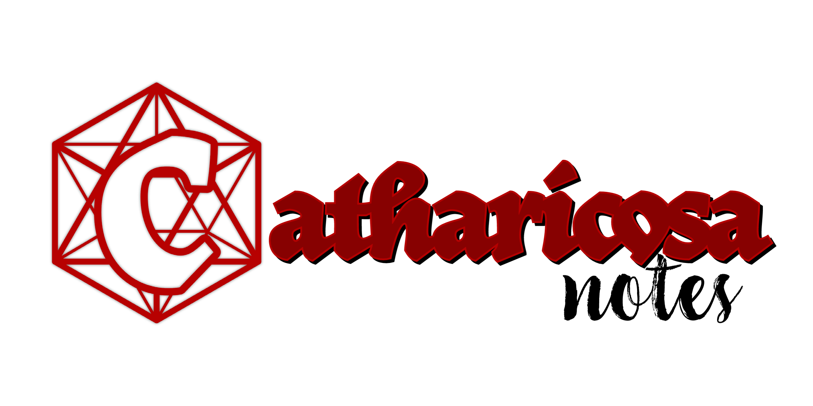

# Note-Taking App for the Meticulous Tabletop Player

## A Guide
- [Writing Notes](#writing-notes)
- [Notelettes](#notelettes)
- [Notebooks](#notebooks)
- [Library Items](#library-items)
    - [Quests](#quests)
    - [NPCs](#npcs)
    - [Locations](#locations)
    - [Organizations](#organizations)
    - [Inventory Items](#inventory-items)
- [D&D Beyond Integration](#dd-beyond-integration)
    - [Switching the Inventory Toggle](#switching-the-inventory-toggle)
    - [Saving Your D&D Beyond Inventory](#saving-your-dd-beyond-inventory)
    - [Importing Your D&D Beyond Inventory](#importing-your-dd-beyond-inventory)
- [Header Dismissal and Zen Mode](#header-dismissal-and-zen-mode)
## Writing Notes

Click the red circle plus button to start a new note. When you start a new note, you cannot create a notelette until you press either the Save button or Ctrl+Enter. After you do that, you may continue the note and edit it by clicking within it and you may create a notelette within the note at any time.

## Notelettes

A Notelette is a small selection within a note that provides context for a previouly establihed idea. You can create a notelette selecting text within a note, right clicking, and clicking on the item for which the notelette provides context. If that item doe not yet exist, you can create it by clicking on the heading that most closely describes it.

**After you create a notelette, you will not be able to edit it by editing its containing note!** You *can* edit it by clicking on it and manipulating the options in the dialog box that pops up. These options include changing the text of the notelette, selecting other items for which it may provide context, and/or deleting the notelette entirely.

When a notelette is deleted, the text of the notelette will remain in the note, but will also become editable just like the rest of the note.

A list of a note's notelette will be available at the end of the note as a drop-down section.

## Notebooks

You may find yourself needing to organize your notes according to separate campaigns, characters or any number of other criterea. In these situations it will be useful to create a new notebook. You may do so by clicking the light-red circle plus button in the top-lefthand corner of the interface next to the "All" button. A dialog will pop up where you can enter the name of a new notebook and click the "Create" button. If you already have a notebook, it will show here with an option to delete.

After you create a new notebook, you may specify that any note or library item should be put into it.

When the notebook is selected, you will only see the information inside it.

Also while the notebook is selected, you may click the notebook's name to change it, pressing Enter to save the new name.

While a notebook is selected, when you search for anything, the search bar will only return results from that notebook.

If you wish to see or search through all of the notes and library items you have made without being filtered by notebooks, you may click the "All" button.

## Library Items

A library item is any item that you will need to refer back to during the course of your game. You can create a library item by clicking the blue square plus button. Currently, library items are divided into five categories: *Quests*, *NPCs*, *Locations*,  *Organizations*, and a final, special category: *Inventory Items*. You can click on the heading for any one of these categories to see an index of all the items within that category and within the currently selected notebook.

### Quests
A quest will require a title and a breif description of any kind. You may also define who sent you on the quest if that NPC exists in your library, or where you need to go for the quest if that location exists in your library. You may also define which notebook the item should be written in.

### NPCs
An NPC will require a name and a breif description. You may alo define where they live if such a location exists in your library, or what organization they are a member of if such an organization exists in your library. You may also define which notebook the item should be written in.

### Locations

A location only requires a name and a breif description. You may also define which notebook the item should be written in.

### Organizations

An organization requires a name and a breif description. You may also define where the organization's headquarters resides if such a location exists in your library. You may also define which notebook the item should be written in.

### Inventory Items

When creating a new Inventory Item, you must give it a name and a description. You may also define where the item is if such a location exists in your library, whether the item is part of a quest if such a quest exits in your library, or whether an NPC owns this item if such an NPC exists in your library.

Inventory Item is a special category because it offers the unique function of importing your inventory from D&D Beyond.

## D&D Beyond Integration
Please note that Catharicosa Notes has no direct affiliation with D&D Beyond, Fandom, or Wizards of the Coast.

### Switching the Inventory Toggle

When you first register and log in to Catharicosa Notes, you will find a text field in the right sidebar with instructions to enter the number found in your D&D Beyond character sheet's URL. Over that text field is a heading with a triangle next to it. Click that triangle and you will find a toggle with the D&D Beyond logo on one side and the Catharicosa logo on the other.

If the toggle is on D&D Beyond you will see your D&D Beyond inventory. If it is on Catharicosa, you will see only your local inventory. The primary difference between the two is that you cannot edit your D&D Beyond inventory from Catharicosa.

### Saving Your D&D Beyond Inventory

When you navigate to your online D&D Beyond character sheet, the URL in your browser's address bar should look something like this:
>https://www.dndbeyond.com/profile/LordSteve/characters/ **14644141**

You want to copy the bold part and paste it into the text field. When you do this, Catharicosa Notes should automatically load your D&D Beyond inventory. If it doesn't, make sure you have the correct number and that your D&D Beyond character profile is set to Public (this will be the very last toggle on the very first page of the character builder).

When your D&D Beyond inventory is loaded, you can click "Save" so that it will be loaded whenever you load the page and/or toggle over to D&D Beyond in the future.

### Importing your D&D Beyond Inventory

While your D&D Beyond inventory is loaded, you may click Import and all the items you have in your D&D Beyond inventory will be transferred into your local library of items. A few note about this process:

- Your items will now be editable! However, they will remain unchanged on D&D Beyond.
- If you gain a new item in D&D Beyond, it will note automatically be transferred to your local library.
- If you import your inventory again in the future without first deleting the original items, you will end up with duplicates.
- Instead of re-importing, it may be easier to simply copy/paste any new D&D Beyond items into a new Catharicosa item.

## Header Dismissal and Zen Mode

Scrolling the interface all the way down to the bottom will bring the header out of view (dimissed) so you can just focus on taking notes and referencing the library. You can also click on the Library (scroll) icon and the Inventory (backpack) icon to make their respective sidebars collapse. With the sidebars collapsed and the header dismissed, you can just focus on writing. We call this Zen Mode. Some players may prefer to write their notes in Zen Mode during the game and then come back later after the game to find and create notelettes and library items.
